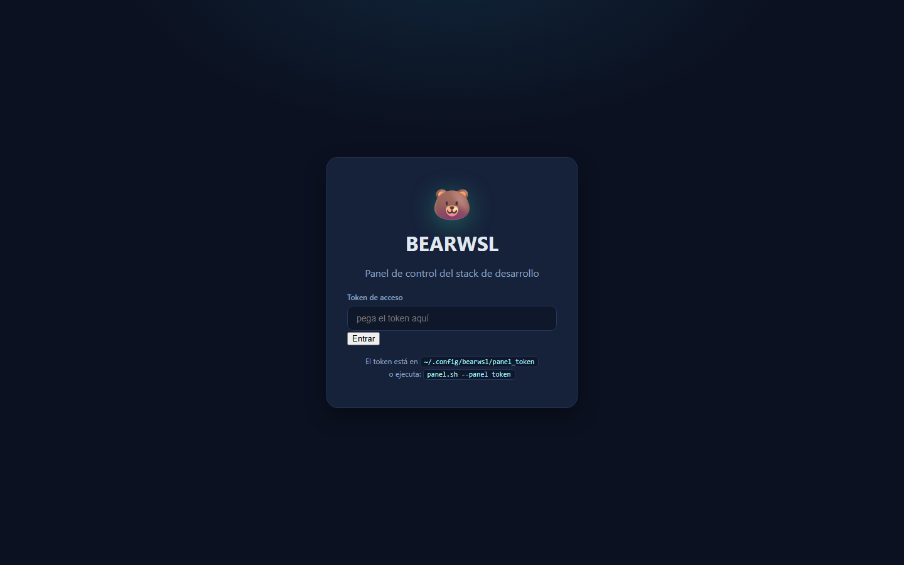
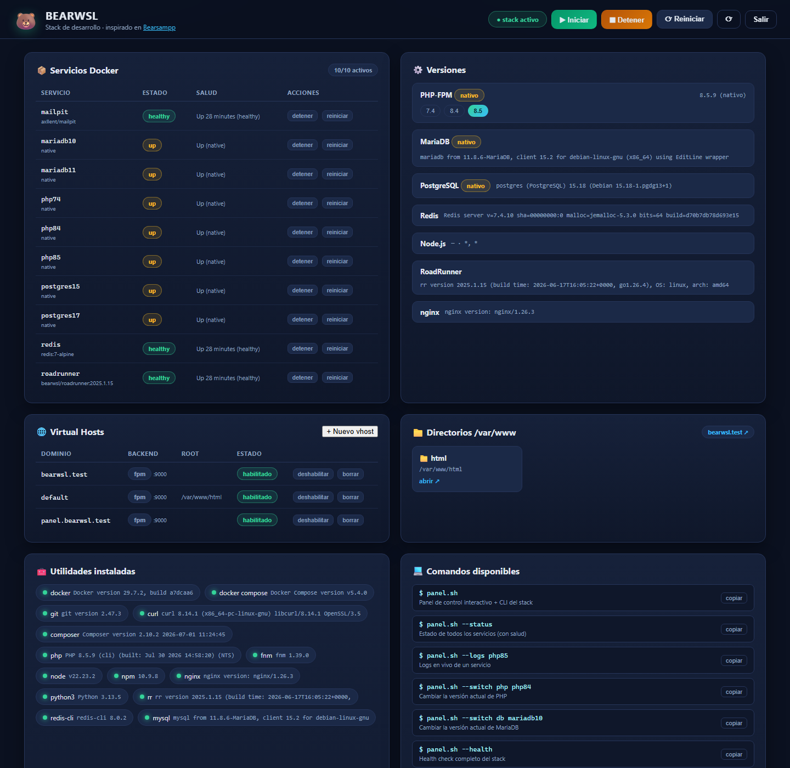

# 🐻 BEARWSL

> Stack de desarrollo web multi-versión para **WSL2 (Linux)**, inspirado en [BearSAMPP](https://bearsampp.com/).

Un instalador único y autocontenido que despliega un entorno de desarrollo completo sobre **Debian 13 (Trixie) en WSL2**: PHP multi-versión, MariaDB, PostgreSQL, Redis, Mailpit, RoadRunner, nginx y un panel web de administración. Elige entre **Dockerizado**, **Nativo** o **Híbrido** según prefieras.

<!-- Tecnologías -->


---

## ⚠️ Requisito: esto es para WSL2

Este stack está diseñado **exclusivamente para Windows con WSL2** (distro **Debian 13 / Trixie** con `systemd` habilitado). No funciona en Linux nativo ni en WSL1.

Para habilitar systemd, añade a `/etc/wsl.conf` dentro de la distro:

```ini
[boot]
systemd=true
```

---

## ✨ Características

- **Modos de ejecución**: Dockerizado (recomendado), Nativo (systemd) o Híbrido — pregunta familia por familia
- **PHP multi-versión**: 7.4 · 8.4 · 8.5 (repo `ondrej/sury`) con extensiones comunes (mysql, pgsql, redis, gd, zip, intl, opcache…)
- **MariaDB multi-versión**: 10.11 · 11.4
- **PostgreSQL multi-versión**: 15 · 17 (clústeres con puertos separados)
- **Redis** + **Mailpit** (SMTP de pruebas con interfaz web)
- **RoadRunner** 2025.x como worker PHP de alto rendimiento (CLI + contenedor para nginx)
- **nginx** con vhosts automáticos (`*.test`)
- **Node.js** vía **fnm** (gestor de versiones)
- **Panel web de administración** con estado en vivo, botones Iniciar/Detener/Reiniciar y creación de vhosts
- **Autostart**: el stack completo se levanta solo al arrancar WSL2
- **A prueba de fallos**: reintentos, verificación de instalación real y recuperación automática de errores

---

## 📸 Capturas

| Acceso (solicitud de token) | Panel web autenticado |
|:---:|:---:|
|  |  |

| Panel web autenticado (vista completa) |
|:---:|
|  |

---

## 🚀 Instalación

1. Copia `install.sh` a tu distro Debian 13:

   ```bash
   cp install.sh ~/ && chmod +x ~/install.sh
   ```

2. Ejecútalo:

   ```bash
   ./install.sh
   ```

   > El instalador es **interactivo**: te pedirá las opciones del stack y la contraseña sudo **una sola vez al principio** (la mantiene fresca durante toda la instalación para no interrumpirte).

3. Opciones que te preguntará:

   | Pregunta | Opciones |
   |---|---|
   | ¿Cómo ejecutar los servicios? | `[1]` Dockerizado · `[2]` Nativo · `[3]` Híbrido |
   | ¿Instalar Docker Engine + Compose? | S / N |
   | ¿Instalar nginx? | S / N |
   | Versiones de PHP | `7.4 8.4 8.5` |
   | Versiones de MariaDB | `10.11 11.4` |
   | Versiones de PostgreSQL | `15 17` |
   | ¿Node.js vía fnm? · Versión | S / N · `22` |
   | ¿Redis + Mailpit (contenedores)? | S / N |
   | ¿RoadRunner? · ¿Panel web? | S / N |
   | ¿Autostart al arrancar? | S / N |

4. **Reabre la consola** para tomar el grupo `docker` y el PATH nuevo, y verifica:

   ```bash
   panel.sh --status
   ```

---

## 🖥️ Uso diario

```bash
panel.sh --status          # Estado de todos los servicios (nativo + contenedores)
panel.sh --mode php db     # Migrar familia a container | native
panel.sh start|stop|restart# Control del stack actual
vhost.sh crear api.test api fpm|roadrunner   # Crear un vhost *.test
```

### Panel web

- **URL**: `http://panel.bearwsl.test:8088` (o `http://127.0.0.1:8088`)
- Estado en vivo de los 10 servicios, botones de control y creación de vhosts.

#### 🔑 El panel pide un token para entrar

El panel está protegido: al abrirlo por primera vez te pedirá un **token de acceso**. Puedes obtenerlo de dos formas:

1. Se muestra al final de la instalación (línea *Token panel*).
2. Está guardado en `~/.config/bearwsl/panel_token`:

   ```bash
   cat ~/.config/bearwsl/panel_token
   ```

Introduce el token en la pantalla de acceso y la sesión quedará abierta en tu navegador. También puedes entrar directamente con el token en la URL:

```
http://panel.bearwsl.test:8088/?token=<tu-token>
```

### Proyectos

- Los proyectos viven en `/var/www`.
- Acceso: `http://bearwsl.test` (autoindex) o `http://tu-dominio.test`.
- Crea vhosts con `vhost.sh` o desde el panel.

### Hosts de Windows (opcional)

Para abrir los dominios `*.test` desde el navegador de Windows, añade a `C:\Windows\System32\drivers\etc\hosts`:

```
127.0.0.1   bearwsl.test panel.bearwsl.test
```

> Se usa `127.0.0.1` (localhost forwarding de WSL2), estable incluso cuando cambia la IP NAT tras un reinicio.

---

## 🏗️ Stack resultante

| Servicio | Versiones | Puerto nativo | Contenedor |
|---|---|---|---|
| PHP-FPM | 7.4 · 8.4 · 8.5 | 9002 · 9001 · 9000 | — |
| MariaDB | 10.11 · 11.4 | 3307 · 3306 | — |
| PostgreSQL | 15 · 17 | 5433 · 5432 | — |
| Redis | 7 | — | 6379 |
| Mailpit | — | — | 1025/8025 |
| RoadRunner | 2025.1.15 | 8080 (nginx →) | — |

---

## 🛡️ A prueba de fallos

El instalador incorpora protecciones aprendidas en batalla:

- **Credenciales al inicio**: `ensure_sudo()` pide la contraseña una vez durante las elecciones y refresca el cache en cada comando.
- **Reintentos** (`retry()`): apt-get update, daemon Docker (5 intentos), clave PGDG y build de RoadRunner.
- **Permisos de repos**: `chmod 644` en los archivos de `sources.list.d` (causa raíz de "paquete no localizado").
- **PGDG robusto**: instala `gnupg`, usa `keyrings/pgdg.asc` con `signed-by`.
- **PHP verificado**: comprueba la instalación real por versión, reintenta si falta y verifica que el FPM arrancó.
- **PostgreSQL 15**: crea el clúster si falta y fuerza el puerto 5433.
- **RoadRunner**: sin `relay: "pipe"` (inválido en RR 2025.x) y con reintento `--no-cache` de la imagen.
- **Autostart estable**: usa `loginctl enable-linger` para que el gestor de usuario systemd no muera con cada sesión y los contenedores no se reinicien en bucle.

---

## 🙏 Créditos

Inspirado en [**BearSAMPP**](https://bearsampp.com/) — un stack portátil WAMP para Windows — con un enorme agradecimiento a su autor: **Troy Hall ([N6REJ](https://github.com/N6REJ))** 🐻

---

[](https://ko-fi.com/X7L625HLNR)

---

## 📄 Licencia

[MIT](LICENSE) © 2026 Keno
